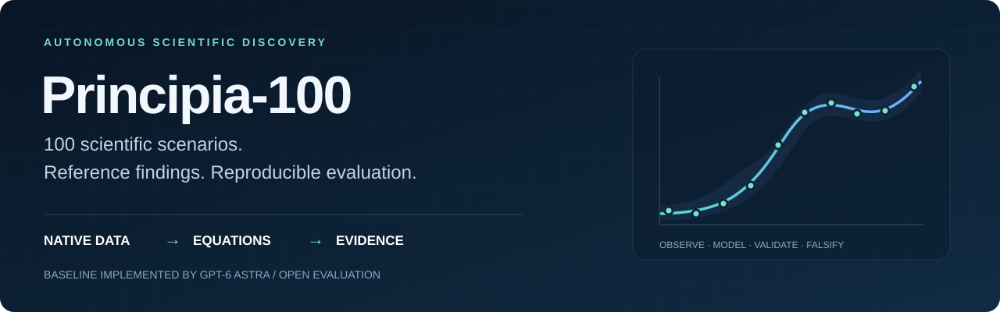

<p align="center"></p>

<h1 align="center">Principia-100</h1>
<p align="center"><strong>100 scientific scenarios. Executable reference findings. Reproducible evaluation.</strong></p>
<p align="center">
  <a href="CATALOG.md"></a>
  <a href="reference/BASELINE.md"></a>
  <a href="EVALUATION_PROTOCOL.md"></a>
  <a href="CHANGELOG.md"></a>
</p>
<p align="center"><a href="CATALOG.md">Explore all 100</a> · <a href="DOWNLOAD.md">Download</a> · <a href="#read-a-reference-result">Read a result</a> · <a href="#evaluate-your-method">Evaluate your method</a> · <a href="EVALUATION_PROTOCOL.md">Protocol</a></p>

**Can a discovery system turn a messy research folder into a useful quantitative relationship—and show where that relationship holds?** Principia-100 connects heterogeneous source data with executable reference results and explicit evaluation contracts. It is a core part of [Principia](../README.md) and supports other agents, methods and human-led research.

The ASD reference portfolios for all 100 scenarios are **implemented by GPT-6 Astra**. They supply equations, coefficients, runnable analysis, predictions, controls, scientific interpretation and preserved failures. Alternative valid findings are welcome; matching the baseline's equation is not the objective.

## Three connected layers

| Layer | Included | Start here |
|---|---|---|
| **Scientific inputs** | 100 source-verifiable scenarios; 1,685 frozen scientific assets; native formats, neutral briefs, provenance and source-specific reuse terms | [Scenario data](scenarios/) · [Source catalog](SOURCE_CATALOG.md) |
| **Reference labels and findings** | 100 Astra portfolios with English PDF/Markdown introductions, equations, frozen states, measured targets, compact evidence and historical attempts | [Results catalog](CATALOG.md) · [Finding-to-evidence register](reference/quality/FINDING_REGISTER.json) |
| **Evaluation** | 134 numerical task versions across 99 cases, one adequacy assessment, raw-data feature access, grouped metrics and structured scientific review | [Task index](TASK_INDEX.json) · [External-agent guide](reference/docs/EXTERNAL_AGENT_GUIDE.md) |

The corpus spans mathematics, computing and AI, devices and manufacturing, physics, chemistry and materials, biology and medicine, social science, and Earth and environmental science. Formats include CSV and workbooks, instrument logs, scientific arrays, waveforms, images, audio, video and computational trajectories. **Source-native** preserves publisher bytes; calibrated, derived and simulated products are labeled as such.

The combined checkout is approximately **5.8 GB** before Git caches and analysis outputs. Native data remain unchanged from v0.1.1. Large files use Git LFS; follow the [download guide](DOWNLOAD.md), including for selective downloads.

## Read a reference result

Each [catalog row](CATALOG.md) links the source folder, a short human-readable PDF, the executable result package and its current scope assessment. These examples show different strengths—not certified new laws or measured deployment benefits:

| Case | Reference contribution | Essential boundary |
|---|---|---|
| [41 · Grid demand](reference/quality/cases/P100-041.md) | A compact residual correction: **283.9 vs 323.9 MW MAE** against the strongest registered comparator | Revised snapshots do not establish operational forecast availability or dispatch savings. |
| [48 · Longwave radiation](reference/quality/cases/P100-048.md) | An interpretable radiation correction: **9.24 vs 13.25 W/m² MAE** | Two calibrated sites; no unseen-site or new-physics claim. |
| [51 · Semiconductor devices](reference/quality/cases/P100-051.md) | Sparse calibrated characterization: **0.01630 vs 0.01766 µA MAE** | Same-device anchors have a measurement cost; one array does not establish manufacturing savings. |
| [54 · Microfracture](reference/quality/cases/P100-054.md) | Geometry-conditioned load prediction: **0.0173 vs 0.0191 mN MAE** | Some geometry may be measured after testing; one wafer limits transfer. |
| [58 · Rheology](reference/quality/cases/P100-058.md) | An unfitted loss response tests a storage-derived constitutive representation; a transfer failure is preserved | Orthogonal validation is useful evidence, not proof of a new universal constitutive law. |

Full-precision coefficients, comparator identities, exposure history and group results are in the linked contracts. Later diagnostic winners do not silently replace development-selected references.

## Evaluate your method

Use Python 3.12. Download the reference package first, then run from `ASD-benchmarks/reference`:

```bash
python3 -m venv /tmp/principia100-env
source /tmp/principia100-env/bin/activate
python -m pip install -r evaluation/requirements.lock.txt

python evaluation/benchmark.py list --all-cases
python evaluation/benchmark.py example --task P100-037.original.v1 --output /tmp/p100-example
python evaluation/benchmark.py score --task P100-037.original.v1 --submission /tmp/p100-example --output /tmp/p100-score
```

The example reproduces a reference submission; it is not a new ASD attempt. Keep outputs outside the release directory. On Windows, use an equivalent Python 3.12 environment and its activation command. The exact tested environment is recorded; a different environment is fingerprinted and must be validated.

Choose the route matching your claim:

1. **Registered prediction task:** submit an alternative equation or predictor under the same target, cohort and information budget. Prediction-file scoring executes no submitted code.
2. **Raw-data ASD:** extract your own features from the permitted native channels, windows and calibration records. Use the versioned raw-access contract and feature lineage; targets and scoring groups remain fixed.
3. **A different finding or endpoint:** submit source anchors, units, equations or falsifiable assertions and a proposed contract. Native reconstruction, two contract reviews and an explicit maintainer decision precede registration.

Metrics include task-specific primary errors, physical-unit MAE/RMSE/bias, per-group and worst-group results, matched controls, coverage and abstention, intervals and defined-event measures where applicable. Scientific review separately assesses mechanism, novelty, significance and practical value. There is **no automatic aggregate discovery score**.

Native reconstruction uses the released source folders, for example:

```bash
python evaluation/benchmark.py prepare --task P100-037.original.v1 --data-root ../scenarios --output /tmp/p100-native
python evaluation/benchmark.py verify
```

See the [full commands and submission contracts](reference/docs/EXTERNAL_AGENT_GUIDE.md). Executable replay requires `--trust-code` and is explicitly trusted local execution, not an untrusted-code hosting service. Do not execute arbitrary submissions without reviewing them.

## Ground truth, evidence and eligibility

Measured observations and exact mathematical quantities provide task targets. **GPT-6 Astra findings are fallible reference baselines**, not uniquely correct laws. Reproductions, validated extensions, novelty candidates, falsifications and justified abstentions have separate meanings. Numerical accuracy alone does not establish a mechanism, novelty or industrial benefit.

All current evaluation outcomes are **exposed**. The original 20 cases were used during Principia development, and source analyses may be available in publications or model training data. Comparisons are open and retrospective; future confirmation requires new, independently reserved evidence.

The [100-case audit](reference/quality/README.md) classifies default tasks as **35 comparative core**, **58 limited-scope**, and **7 diagnostic/adequacy**. These are task eligibility tiers, independent of whether the baseline succeeds. Case 8 deliberately provides a source-adequacy assessment rather than fabricated clinical prediction labels. Case 5's constant target is not a discriminating prediction problem; certificate checks require an explicit scientific contract. Scoring groups are not automatically independent experiments.

Optional case-58 PLA tasks use declared supplemental archives. The unresolved case-96 supplemental dataset is excluded from the public package; the original-data case remains included. Unknown training histories, calibration burdens, ambiguous units and source preprocessing remain visible. Read [release validation](RELEASE_AUDIT.md) and the [issue register](reference/quality/ISSUES.md).

## Package map

```text
ASD-benchmarks/
├── scenarios/                 # 100 source folders: raw/, context/, brief, provenance
├── CATALOG.md                 # Links data, results and evaluation for every case
├── TASK_INDEX.json            # Machine-readable cross-layer index
├── reference/
│   ├── cases/P100-NNN/         # PDF/Markdown, equations, code and evidence
│   ├── tasks/                 # Frozen numerical contracts, labels and reference predictions
│   ├── assessments/           # Source-adequacy evaluation
│   ├── contracts/             # Raw-data information budgets
│   ├── evaluation/            # Shared CLI, replay, preparation and review tools
│   ├── quality/               # Eligibility and finding-to-evidence bindings
│   └── reviews/               # Retained reviews and scoped adjudications
├── task_cards/                # Original acquisition-stage scientific context
└── tools/                     # Source integrity, recovery and publication checks
```

[Download and verify](DOWNLOAD.md) · [Protocol](EVALUATION_PROTOCOL.md) · [Dataset card](DATASET_CARD.md) · [Source provenance](ACQUISITION_MANIFEST.json) · [Reuse terms](LICENSES.md) · [Contribution guide](CONTRIBUTING.md)

## Cite and contribute

Cite **Principia contributors (2026), Principia-100, v0.2.0**, the release tag/commit, task and protocol IDs, evaluator identity, and the original dataset authors. Record the baseline as **implemented by GPT-6 Astra** when comparing against it. [CITATION.cff](CITATION.cff) and [source citations](CITATIONS.json) provide attribution details.

Source data retain their own licenses. Curator documentation is CC BY 4.0 and curator tools are MIT; these terms do not override embedded source notices. Useful contributions include alternative quantitative findings, counterexamples, reader fixes, better controls and independently collected validation evidence. Open an [issue](https://github.com/pzqpzq/Principia/issues) with the case/task ID and reproducible evidence.
