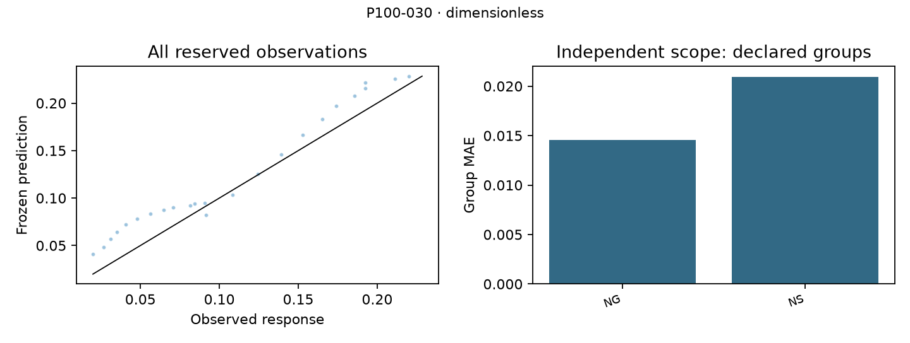

# P100-030: Calibrated low-speed lubricant friction

## What the scenario contains

Six formulations were developed with leave-formulation-out validation; N+S functionalization and NG supplier curves were reserved. Duplicate curves cannot cross partitions. Both endpoint calibrations are provided for every curve. Scoring covers only 0.28–10 mm/s and tests calibrated shape transfer, not unmeasured-lubricant performance. The endpoint is coefficient of friction, reported in dimensionless. Native files remain unchanged; preparation is deterministic and hash-verified.

## Supported result and its interpretation

The concentration-dependent load-sharing extension does not survive reserved-formulation comparison with simple calibrated log-speed interpolation. Its development gain is preserved as a failed transfer hypothesis, not benchmark ground truth.

**Admission:** unsupported; **classification:** unsupported.

For speed $v$ in mm/s and particle concentration $c$ in wt.%, define
\[
v_s=v_0e^{\gamma c/5},\qquad f(v)=[1+(v/v_s)^p]^{-1}.
\]
Given measured calibration coefficients $\mu_L=\mu(0.2)$ and $\mu_H=\mu(500)$,
\[
\widehat\mu(v)=\mu_H+(\mu_L-\mu_H)\frac{f(v)-f(500)}{f(0.2)-f(500)}.
\]
Both calibration endpoints are supplied even for reserved formulations. The expression preserves their values exactly. Its concentration dependence was selected in development but did not beat simple log-speed interpolation in confirmation.

| Coefficient | Value | Unit |
|---|---:|---|
| `v_0` | 1.1629451 | mm/s |
| `p` | 1.1856763 | dimensionless |
| `gamma` | 1.5641271 | dimensionless |

## Validation and performance

The selected reference was fixed after 5 substantive development attempts. Whole-group development MAE was **0.00683145**; reserved-group MAE was **0.0177607 dimensionless** across 24 scored rows and 2 top-level groups. Groups, not individual dependent rows, define the scope of validation.

| Model | Confirmation MAE |
|---|---:|
| Selected: Concentration-shifted load sharing | 0.0177607 |
| Constant response | 0.068107 |
| Flexible calibrated friction | 0.0369342 |
| Calibrated log-speed interpolation | 0.0131409 |

The lowest observed confirmation error among all frozen models is 0.0131409 for Calibrated log-speed interpolation. This is a diagnostic comparison; it does not replace the development-selected reference.

## Failures, limitations and value

Concentration alone does not guarantee calibrated curve-shape transfer across surface treatment and supplier. The reserved-formulation reference MAE exceeds log-speed interpolation despite a large development improvement. All attempts and unfavorable results remain traceable in research history. Parameter vectors, group errors and all predictions are supplied; population confidence claims are not justified by this small or single-system campaign.

The useful contribution is an executable, auditable test of the stated response and its alternatives. No independent experiment, exhaustive novelty adjudication, validated deployment benefit or new universal physical law is claimed. Source-author analyses are prior art. Current outcomes are exposed and cannot become a fresh holdout by renaming this task.

## Reproduce or evaluate another finding

Run `python run.py` in this folder to verify integrity and reproduce saved predictions and metrics. `python run.py --input INPUT.csv --output predictions.csv` applies all frozen equations to a compatible input table. `task_spec.json` defines allowed inputs, calibration, units and grouping; use the shared Principia-100 evaluator for comparable prediction submissions. A different endpoint or information budget requires a separate frozen task.

The numerical score is equal-group MAE, supplemented by group RMSE, bias, error quantiles and applicable physical checks. Predictive accuracy and mechanistic/novelty review are separate; abstention and valid alternative discoveries remain admissible.

## Source and prior art

[Primary source study](https://www.sciencedirect.com/science/article/pii/S0301679X26007504); [authoritative dataset](https://zenodo.org/records/17864405). See `SOURCE_MANIFEST.json` for byte-level provenance and research history for the native-semantics audit, exclusions and literature record.
